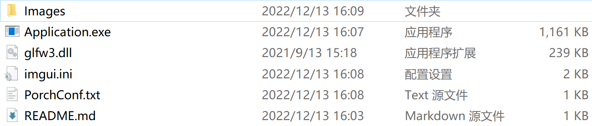

# PorchConfigurationAssistant 使用指引
- [PorchConfigurationAssistant 使用指引](#porchconfigurationassistant-使用指引)
  - [软件环境](#软件环境)
  - [使用方法](#使用方法)
  - [编译环境](#编译环境)
  - [项目地址](#项目地址)

## 软件环境
软件文件夹结构如图: 

项目中包含
- Images文件夹（存储示例图）
- Application.exe（程序）
- glfw3.dll（使用OpenGL和GLFW绘制所需的动态库）
- imgui.ini（窗口属性文件，将会在第一次运行程序后自动生成）
- libgcc_s_seh-1.dll（依赖动态库）
- libstdc++-6.dll（依赖动态库）
- libwinpthread-1.dll（依赖动态库）
- PorchConf.txt（存储所有Porch配置）
- README.md（本文件）

## 使用方法

1. 双击 Application.exe 运行程序 
2. 程序左上角菜单栏有 File 和 Window 两个子项 
3. 单击 File 弹出 Open Porch File 选项 
4. 单击 Open Porch File 选项可以浏览 PorchConf.txt 中存储的配置（如无配置则会显示 No Conf exists.） 
5. 您可以在 Porch Conf Window 中删除指定配置 
6. 单击 Window 弹出 Add burst mode DSC window 和 Add burst mode NonDSC window 窗口，这两个选项分别用于创建 DSC 机型配置和 NonDSC 机型配置  
7. 您需要键入窗口名称，如果您保存了配置，该名称将会作为配置名称保存至 PorchConf.txt
8. 创建窗口后，输入特定参数，在满足运算条件的情况下，将会实时为您显示计算结果。 
9.  您可以点击 Save To File 将配置保存至 PorchConf.txt （必须键入所有参数才能保存配置）

## 编译环境

项目配置：
1. 项目主要语言：C++ 11（主要编码工作位于 main.cpp 和 utility.hpp 中）
2. 编译器：GCC 8.1.0 x86/x64 build by MinGW
3. UI库：Dear Imgui [link](https://github.com/ocornut/imgui)
4. 窗口库：GLFW（基于 OpenGL 绘制窗口，还使用了 GLAD）

项目引用的静态库：
1. libglfw3dll.a
2. libglad.a
3. Gdi32.Lib

项目依赖的动态库:
1. glfw3.dll
2. libgcc_s_seh-1.dll
3. libstdc++-6.dll
4. libwinpthread-1.dll

## 项目地址

[Github Source Code link](https://github.com/zionFisher/PorchConfigurationAssistant)  
[Release Package link](https://github.com/zionFisher/PorchConfigurationAssistant/releases/tag/PCA-Release)